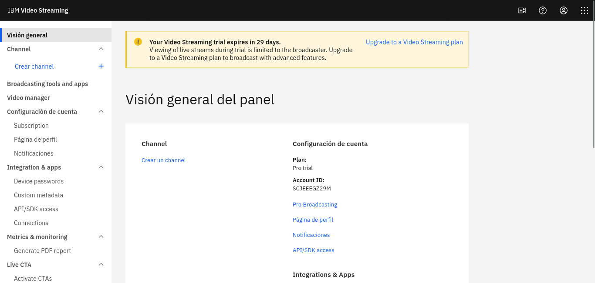

---
geometry:
- margin=0.8in
title: Prova d'Avaluació Continuada 3 (PEC3)
author: 
 - Luca Rullo
colorlinks: true
fontsize: 12pt
toc: true
toc-depth: 1
categories:
- Plataformes de publicació i distribució
date: "2023-06-01"

---

# Clip de vídeo incrustat en HTML 5

Aquest cop, com a vídeo utilitzaré el material públic sota llicència _CC SA - Remix_ del curt Big Buck Bunny de la Blender Foundation. Podem accedir als primers segons del material a Wikimedia [^1] i podem descarregar el vídeo sota format OGV.

~~~
$ wget https://upload.wikimedia.org/wikipedia/commons/
	f/f3/Big_Buck_Bunny_first_23_seconds_1080p.ogv -O video.ogv
~~~

Ara, retallem els primers 20s utilitzant _ffmpeg_:

~~~
$ ffmpeg -ss 00:00:00 -to 00:00:20 -i video.ogv video_crop.ogv
$ ffprobe video_crop.ogv
  ....
  Input #0, ogg, from 'video_crop.ogv':
  Duration: 00:00:20.00, start: 0.000000, bitrate: 11867 kb/s
  Stream #0:0: Video: theora, yuv420p, 1920x1080, 24 fps, 24 tbr, 24 tbn
    Metadata:
      encoder         : Lavf60.3.100
  Stream #0:1: Audio: vorbis, 48000 Hz, stereo, fltp, 192 kb/s
    Metadata:
      encoder         : Lavf60.3.100
~~~

El format el podem deixar amb el container OGV i el còdec Theora, compatible amb HTML5, però per fer la pràctica el transformarem al container _webm_ i els còdecs vp9 per vídeo i vorbis per àudio. Amb _ffmpeg_ és força simple fer el procès, però utilitzaré Avidemux per seguir la pràctica.

__PROBLEMA:__ La meva versió d'Avidemux dona problemes amb OGV (  Avidemux v2.8.1 a una GNU/Debian 12), sembla tenir problemes amb el demultiplexor per OGV, faré el canvi a WEBM utilitzant _ffmpeg_

~~~ 
$ ffmpeg -i video_crop.ogv video.webm
$ ffprobe video.webm
  ...
  Input #0, matroska,webm, from 'video.webm':
  Metadata:
    ENCODER         : Lavf60.3.100
  Duration: 00:00:20.01, start: 0.000000, bitrate: 4908 kb/s
  Stream #0:0: Video: vp9 (Profile 0), yuv420p(tv, progressive), 1920x1080, SAR 1:1 DAR 16:9, 24 fps, 24 tbr, 1k tbn
    Metadata:
      ENCODER         : Lavc60.3.100 libvpx-vp9
      DURATION        : 00:00:20.000000000
  Stream #0:1: Audio: opus, 48000 Hz, stereo, fltp
    Metadata:
      ENCODER         : Lavc60.3.100 libopus
      DURATION        : 00:00:20.011000000
~~~

El resultat es un webm a vp9/opus.

Per fer la pràctica amb Avidemux, faré canvi a MP4 amb els còdecs AVC/AAC com recomanen a la documentació de Mozilla Developers [^mwd]

I al finalitzar, tenim 3 vídeos:

* video_crop.ogg (theora/vorbis)
* video.webm (VP9/Opus)
* video.mp4 (AVC1/AAC)

[^mwd]: https://developer.mozilla.org/en-US/docs/Web/Media/Formats/Video_codecs#choosing_a_video_codec
[^1]: https://commons.wikimedia.org/wiki/File:Big_Buck_Bunny_first_23_seconds_1080p.ogv

Creem el fitxer index.html:

~~~
<html>
 <head>
  <title>Pac 3</title>
  
 </head>
 <body>
  <video controls>
   <source type="video/ogg" src="video/video_crop.ogg" />
   <source type="video/webm" src="video/video.webm" />
   <source type="video/mp4" src="video/video.mp4" />
  </video>
 </body>
</html>

~~~

El tag _video_ ens oferirà la possibilitat de visualitzar un vídeo directament sobre el nostre web, front a utilitzar, per exemple, un enllaç al fitxer, que faria descarregar el fitxer. A més, podem controlar diversos aspectes de l'objecte _video_ utilitzant la seva API, per exemple, gestionar events de parada o arrencada, de canvi dels controls, ... És interessant perquè d'aquesta manera s'incorpora al DOM del HTML com si fos un altre element més i és pot gestionar d'una manera més correcte amb relació a la resta de la web.

L'opció de la incrustació directa del vídeo també ens limita en l'aspecte que no hem pujat el nostre media a cap CDN, per tant, si tenim una càrrega molt gran al sistema el que obtenim es una limitació d'accès al usuaris i una sobrecàrrega del servidor, que no podrem controlar. Si aquest mateix fitxer el publiquem a un CDN (dins un bucket, per exemple) podem utilitzar la URL que ens ofereix el proveidor i així distribuir la càrrega de l'accès al fitxer.

Un altre problema és que no podem limitar per exemple la descàrrega del fitxer utilitzant aquest mètode. Si treballem amb HLS o DASH, com el que descarrega l'usuari és un M3U8, un playlist de blocks de l'arxiu original, aconseguim que l'usuari només té accès a petites parts del vídeo complet i, per tant, podem gestionar millors la limitació a la descàrrega o la selecció de cert tipus de fitxer segons l'ample de banda. Una opció sense utilitzar un CDN per el nostre material de vídeo, es convertir-lo en DASH o HLS i exposar-lo al nostre web amb un player adaptat a aquest format. Servidors web com Nginx ofereixen opcions molt còmodes per gestionar aquest tipus de possibilitats amb mòduls que amplien les seves funcionalitats[^nginxrtmp].

[^nginxrtmp]: https://github.com/arut/nginx-rtmp-module

En un context més professional, s'utilitzen altres reproductors que amplien les funcions de l'element vídeo per poder utilitzar, per exemple, materials en HLS o DASH i millorar el rendiment i ample de banda del servei de vídeo per a diverses resolucions o canals d'àudio ( VideoJS[^videojs] és un bon exemple ) o altres extensions per poder treballar amb audio 3D ( Hoast360 [^hoast360] ).

[^hoast360]: https://github.com/thomasdeppisch/hoast360
[^videojs]: https://videojs.com/

Per fer les proves, l'obro directament amb Firefox, però per publicar-lo, crearé una nova pàgina a la web de presentacions de pràctiques personals a Github Pages.

Per fer alguns canvis, activo i desactivo els tags controls, controlslist, crossorigin, loop, muted, poster i preload. Alguns tags són més experimentals i suposo que no funcionen 100% a tots els navegadors [^mwdv].

[^mwdv]: https://developer.mozilla.org/en-US/docs/Web/HTML/Element/video

Sobre les funcionalitats oferides per part dels CDN, podem dir que cada cop són més grans. Des de les funcions bàsiques de transcodificació a HLS/DASH o d'aplicar certes AI per al reconeixement de canvi de pla o detecció facial, com es comenten a l'exercici; però també, com exposa Amazon AWS a la seva secció de Media Services [^awsm], ofereixen un sistema d'edició i generació de continguts directament al núvol (renderitzat, creació de malles de partícules, animació..), sistemes de VOD directament al nostre media center, adaptació per a múltiples dispositius (AWS Elemental Live), anuncis personalitzats, ...

Google Cloud, amb Live Stream API, OpenCue, Video Stitcher API o Transcoder API ofereix també solucions similars [^gcloud].

[^gcloud]: https://cloud.google.com/
[^awsm]: https://aws.amazon.com/es/media-services/?nc1=h_ls

<html>
 <head>
  <title>Pac 3</title>
  
 </head>
 <body>
  <video controls>
   <source type="video/ogg" src="video/video_crop.ogg" />
   <source type="video/webm" src="video/video.webm" />
   <source type="video/mp4" src="video/video.mp4" />
  </video>
 </body>
</html>

# Streaming d'un vídeo local via RTP

Utilitzaré el mateix material que hem treballat a la secció anterior per fer l'streaming via VLC. Com ja tenim una versió en MP4, treballaré la codificació de la tasca 2.1 amb el fitxer _video.mp4_

El converteixo en MKV com s'indica amb Avidemux i el resultat a Media Info:

~~~

Video
ID                                       : 1
Format                                   : AVC
Format/Info                              : Advanced Video Codec
Format profile                           : High@L4
Format settings                          : CABAC / 4 Ref Frames
Format settings, CABAC                   : Yes
Format settings, Reference frames        : 4 frames
Codec ID                                 : V_MPEG4/ISO/AVC
Duration                                 : 20 s 83 ms
Bit rate                                 : 5 000 kb/s
Width                                    : 1 920 pixels
Height                                   : 1 080 pixels
Display aspect ratio                     : 16:9
Frame rate mode                          : Constant
Frame rate                               : 24.000 FPS
Color space                              : YUV
Chroma subsampling                       : 4:2:0
Bit depth                                : 8 bits
Scan type                                : Progressive
Bits/(Pixel*Frame)                       : 0.100
Stream size                              : 11.8 MiB (96%)
Writing library                          : x264 core 164
Encoding settings                        : cabac=1 / ref=3 / deblock=1:0:0 / analyse=0x3:0x113 / me=hex / subme=7 / psy=1 / psy_rd=1,00:0,00 / mixed_ref=1 / me_range=16 / chroma_me=1 / trellis=1 / 8x8dct=1 / cqm=0 / deadzone=21,11 / fast_pskip=1 / chroma_qp_offset=-2 / threads=6 / lookahead_threads=1 / sliced_threads=0 / nr=0 / decimate=1 / interlaced=0 / bluray_compat=0 / constrained_intra=0 / bframes=3 / b_pyramid=2 / b_adapt=1 / b_bias=0 / direct=1 / weightb=1 / open_gop=0 / weightp=2 / keyint=250 / keyint_min=25 / scenecut=40 / intra_refresh=0 / rc_lookahead=40 / rc=2pass / mbtree=1 / bitrate=5000 / ratetol=1,0 / qcomp=0,60 / qpmin=0 / qpmax=69 / qpstep=4 / cplxblur=20,0 / qblur=0,5 / ip_ratio=1,40 / aq=1:1,00
Default                                  : Yes
Forced                                   : No
DURATION                                 : 00:00:20,084000000

Audio
ID                                       : 2
Format                                   : MPEG Audio
Format version                           : Version 1
Format profile                           : Layer 3
Codec ID                                 : A_MPEG/L3
Codec ID/Hint                            : MP3
Duration                                 : 20 s 84 ms
Bit rate mode                            : Constant
Bit rate                                 : 128 kb/s
Channel(s)                               : 2 channels
Sampling rate                            : 48.0 kHz
Compression mode                         : Lossy
Stream size                              : 314 KiB (2%)
Default                                  : Yes
Forced                                   : No
DURATION                                 : 00:00:20,051000000

~~~

Si realitzem l'streaming, la latència entre les pausades es aproximadament de 2/3 segons. El vídeo no es reprodueix fluidament.

La taxa de bits de contingut de l'emissió 1077 kb/s
La taxa de bits de contingut del receptor es de 1472 kb/s

Si la taxa de bits original és de 5000 kb/s (mitjana) i la taxa per l'emissió es de 1077 kb/s mitjana, podem dir que el factor de compressió és aproximat a 5:1. Encara que després de diverses proves, el rendiment al meu computador és molt fluctuant.

Per fer unes proves, he desactivat la transcodificació i faig la emissió sense transcodificar. El vídeo es reprodueix fluidament. El temps de latència entre l'emissió i la parada és d'uns 5 segons. He fet també proves amb el còdec d'emissió H264+MP3(ts) amb resultats similars a la primera versió.

# Emissió d'Streaming amb IBM Streaming Service

A la primera pràctica vaig realitzar un anàlisis de la utilització de Google Cloud per fer una emissió amb tot el procès de generació d'usuaries i construcció de canals. A la segona pràctica vaig revisar l'alternativa de Cloudflare per fer streaming. En aquest darrera pràctica analitzarem l'opció d'IBM per fer streaming.

IBM porta molts anys essent una gran empresa dedicada a solucions diverses a la xarxa, treballant sobretot amb grans institucions/empreses. El seu catàleg de productes està sempre molt orientat a aquest tipus de clients i, per tant, a diferència d'altres empreses de clouding, tenen uns plans i unes opcions molt específiques. A més, no és massa senzill trobar documentació, com és el cas d'Amazon o Google, però mirarem d'analitzar i provar els serveis que ofereixen entorn a l'Streaming.

Per iniciar-nos en aquests serveis, IBM ens proposa el seu portal de Video IBM [^videoibm] on podem descobrir gran part dels seus productes. Ens enfocarem en els dos grans productes destinats a Streaming, però podem trobar també els serveis més orientats a distribució de mitjans com: Video distribution and Workflow, OTT Video o Video Monetization; incorporat en un producte anomenat IBM Watson Media Solution [^ibmwatson]. La utilització de la IA per generació de subtitulació automàtica o la generació de voice-over són algunes de les seves propostes dins aquest paquet, que, a més, incorpora una plataforma pròpia on presentar els continguts emesos i gestionar els accessos via pagament o subscripció. 

Sobre IBM Video Streaming, el servei bàsic:

> **IBM Video Streaming:** Un servei de transmissió SaaS escalable (programari com a servei) per a la transmissió en directe o contingut de vídeo sota demanda amb el qual és fàcil començar. Arribeu al públic mitjançant incrustacions, URL oberts o canals protegits amb contrasenya. Admet reproduccions en directe simultànies a diversos canals que poden funcionar les 24 hores del dia o més. Capaç d'escalar mitjançant el lliurament multi-CDN integrat. Ofereix superposicions de vídeo en què es poden fer clic i reproducció de vídeo en directe, simulada i sota demanda.

Aquest és el producte bàsic d'streaming via IBM, i suposo que és el més antic per la data de publicació de la seva presentació. Diuen que està pensat per suportar fins a 1.2M+ d'audiències simultànies i amb la gestió via el dashboard que ofereixen. Té suport per VOD, eines d'interactivitat (Q&A, enquestes, ...) i utilitza diversos RTMP encoders. Com altres serveis, compatible amb les eines de Watson. Segons el que trobo al web, aquesta plataforma va ser el resultat de la compra de l'empresa UStream.tv.

Els preus[^ibmprices] estan basats en diverses categories segons hores d'espectadors. No tinc massa clar aquesta mesura, però suposo que com en altres serveis, la mesura es basa en la quantitat d'usuaris i el temps que estan connectats. 10 hores d'espectadors entenc que vol dir que pots tenir un sol espectador connectat 10 hores seguides o 10 espectadors connectats 1 hora, similars als càlculs d'utilització de serveis al cloud d'altres empreses, encara que hem sembla massa car comparat amb altres opcions que hem revistat anteriorment. També és possible que en la traducció al castellà no es faci correctament i _100 viewer hours_ vol dir 100 espectadors per hora. A més, que passa si tens més visites de les esperades, com fluctua el preu ? (He escrit un correu a IBM per preguntar aquest dada però potser on tinc resposta abans de poder presentar la pràctica)

Hi ha una opció gratuïta de 30 dies i el pla més bàsic és el Silver amb 100h d'espectadors, 5 canals, 1TB d'espai per vídeo, transcodificació, control de vídeo i l'API, marca del canal-contrasenya i portal de registre, interactivitat amb chat/enquestes/.. , subtitulat automàtic al guardar el vídeo i possibilitat de fer un fals directe o crear llistes de reproducció. Aquest paquet té un cost de 143€/mes, és a dir, si fem una emissió d'una hora amb 10 espectadors, segons el que entenem del preu, hauríem d'aconseguir uns 14,3€ per espectador (via subscripció o publicitat) per a ser mínimament no deficitària l'emissió. El paquet més gran, Platinium, té un cost de 1442€/mes i ens ofereix fins a 5000h d'espectadors. 

L'opció  IBM Enterprise Video Streaming està pensada per emissions dins d'empreses, ajuntaments, governs, institucions de manera interna, sembla més pensat com una eina similar a Zoom, Jitsi, ... però amb les capacitat de Watson AI i l'ús de la xarxa CDN d'IBM.

Abans de passar a revisar el _dashboard_ d'IBM he volgut investigar una mica sobre la transmissió de vídeo a baixa latència, una situació molt comú quan es fan realitzacions en directe i es vol enviar la senyal a un centre de control on es desenvolupa l'edició i publicació final del contingut audiovisual. Normalment, en aquests casos, l'emissió és via satèl.lit però, per exemple, IBM proposa la utilització del seu producte Aspera Streaming[^asperastreaming]. Posa en qüestionament la utilització de protocols IP FEC over UDP, per la seva alta latència degut a la pèrdua de paquets i proposa la utilització del seu protocol de transferència patentat IBM Aspera FASP[^fasp], un UDP però utilitzant algunes característiques del protocol SSH. El preu es basa en l'ample de banda necessitat. Segons la seva calculadora de velocitats, enviar 100GB de dades a 10Mbps (un ample de banda molt estret) a una latència màxima de 140ms dins d'Europa, per TCP, trigaria uns 2,4 dies, per Aspera 23,9h. El preu no és públic, o no es pot trobar amb massa facilitat.

[^fasp]: https://en.wikipedia.org/wiki/Fast_and_Secure_Protocol
[^asperastreaming]: https://www.ibm.com/es-es/products/aspera/streaming

Per analitzar millor el dashboard, l'accessibilitat i altres opcions, he registrar un compte gratuït a la plataforma d'IBM.

Accedim a la creació del compte i omplim el formulari. Haurem de validar el nostre correu i després, fer una segona validació per utilitzar un 2FA. Quan hem acabat, podrem accedir al nostre dashboard.

Per iniciar, crearem un canal des del menú _Channel_. Jo l'anomeno _UOC Pràctica_ amb l'idioma per defecte Català. Quan finalitzem, ja tenim un canal creat disponible des de la URL https://video.ibm.com/channel/J3qNEwvvRfg

En principi, el canal es manté en privat (Viewing of live streams during trial is limited to the broadcaster. Upgrade to a Video Streaming plan to broadcast with advanced features.)

Al Dashboard podem personalitzar-lo: Canviar la imatge, activar l'auto-enregistrament, activar multi-quality streaming (de 240p fins a 480p), podem afegir un password per accedir, ajustar la geolocalització del usuaris permesos, activar o desactivar el chat/cerca/Q&A/enquestes, l'obligació a registrar els usuaris per accedir al vídeo, ...

En la secció de continguts, ens dona l'opció de crear un playlist pujant vídeos, decidir que es veu quan estem off-air (últim vídeo per defecte, vídeos seleccionats, ...), podem crear esdeveniments que es visualitzant a la nostra pàgina del canal a la pestanya pròximes emissions, ... En el nostre cas, volem mirar com podem fer un streaming contra el nostre canal, per tant, anirem a l'opció del menú _Broadcasting tools and apps_.

Per fer-ho, ens proposta algunes eines com Streamlabs[^slabs], Larix Brodcaster[^larix], Broadcast Me[^bme] o eines de vídeo conferència com WebEX, Zoom, Microsoft Teams, BlueJeans, o aplicacions desktop com Streamlabs, OBS Studio[^obs], Wirecast[^wirecast] o inclús, utilitzar les APIs dels serveis de StreamLabs, Streamaxia o Larix. 

[^slabs]: https://streamlabs.com/
[^larix]: https://softvelum.com/larix/
[^bme]: https://apps.apple.com/us/app/broadcast-me/id491982406
[^obs]: https://obsproject.com/
[^wirecast]: https://www.telestream.net/wirecast/

Jo, per comoditat, utilitzaré OBS, que ja el tinc instal.lat al meu desktop. La documentació està publicada a la web d'IBM [^ibmobs]. Ens indica que per fer l'emissió anem a l'opció Broadcast Settings del menú i accedim a Enconder settings. Aquí podem trobar la URL per l'emissió via RTMP i el key per fer-la. 

Accedeixo a OBS i, per exemple, faig un playlist de vídeos per l'emissió. Utilitzaré el mateix vídeo que hem fet a l'inici de la pràctica (Big Buck Bunny de Blender). Ara, vaig a l'opció "Ajustes" > "Emisión" i selecciono Servei Personalitzat i omplo la URL i el key amb les dades del Dashboard d'IBM. Ara, enregistro els canvis i torno a la pantalla inicial d'OBS. Faig clic a "Iniciar Transmissión" i si tot va bé, apareixerà una icona inferior on s'indica que l'emissió està funcionant i els kbs d'emissió.

En el nostre cas, tot correcte, emissió en directe per RTMP a 3000kbps de mitja contra IBM.

Si faig les proves d'aturada i inici el temps de resposta és molt més gran que en local via RTP, uns 15 segons de latència.

Si paro la retransmissió, el canal queda off-air i si vaig al dashboard tinc el material de vídeo enregistrat per validar la seva publicació. 

Finalment, per no expandir massa aquest document indicar que tota la gestió per fer l'streaming utilitzant IAM i altres mètodes d'autenticació, en el cas d'IBM queda "ofuscat" per el seu dashboard i, per tant, no he pogut aplicar gaires opcions en aquest àmbit. També és cert que la definició del seu servei d'Streaming indiquen clarament que es un SaaS i, a més, està basat en la estructura que ja tenia Ustream.tv. Així i tot, aprofitem el CDN que té IBM, però no queda massa clar com personalitzar-lo. La decisió d'utilitzar IBM front altres ha estat la curiositat dels seus serveis amb Watson AI, que, més enllà d'una opció al menú, no semblen gaire més configurables. Potser, utilitzant la seva API es poden fer moltes més coses. Si revisem la primera pràctica amb Google Cloud i l'emissió via rtmp amb HLS podem trobar totes aquestes proves i les necessitats de generar usuàries, rols i tokens per a la emissió i la selecció personalitzada dels nodes de sortida i les regions, amb els preus inclosos.

[^ibmobs]: https://support.video.ibm.com/hc/en-us/articles/207851987-How-to-stream-to-IBM-Watson-Media-using-Wirecast-OBS-TriCaster-or-any-RTMP-encoder
[^ibmprices]: https://www.ibm.com/products/video-streaming/pricing
[^ibmwatson]: https://www.ibm.com/watson
[^videoibm]: https://video.ibm.com/
